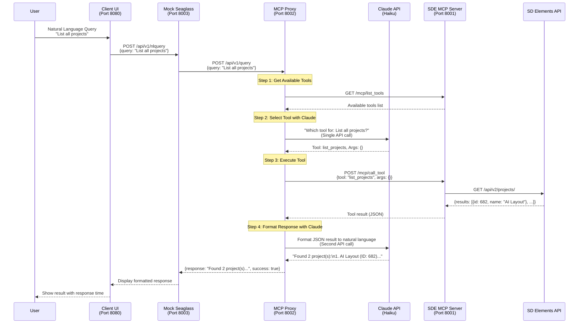

# Developer's Guide: Seaglass-SDE MCP Natural Language Interface

## Overview

This prototype demonstrates a natural language interface for SD Elements that enables users to interact with the SD Elements API using plain English queries. The system translates natural language into MCP tool calls, executes them, and returns formatted responses.

## Quick Start

### Prerequisites

- Docker and Docker Compose
- SD Elements API credentials (host URL and API key)
- Anthropic API key (for Claude)

### Clone and Setup

```bash
# Clone the repository
git clone <repository-url>
cd sde-mcp

# Checkout the feature branch
git checkout feature/poc-sea-sde-mcp-workflow

# Create environment file
cp env.example .env

# Edit .env and add your credentials:
# - SDE_HOST=https://your-instance.sdelements.com
# - SDE_API_KEY=your-sde-api-key-here
# - ANTHROPIC_API_KEY=your-anthropic-api-key-here
# - CLAUDE_MODEL=claude-3-5-haiku-20241022 (optional)
```

### Run with Docker Compose

```bash
# Start all services
docker-compose up --build

# Services will be available at:
# - Client UI: http://localhost:8080
# - Mock Seaglass: http://localhost:8003
# - MCP Proxy: http://localhost:8002
# - SDE MCP Server: http://localhost:8001
```

### Run Locally (Development)

```bash
# Terminal 1: Start SDE MCP Server
cd sde-mcp
export SDE_HOST=https://your-instance.sdelements.com
export SDE_API_KEY=your-key
python -m sde_mcp_server

# Terminal 2: Start MCP Proxy
cd mcp-proxy-service
export MCP_SERVER_URL=http://localhost:8001/mcp
export ANTHROPIC_API_KEY=your-key
export CLAUDE_MODEL=claude-3-5-haiku-20241022
uvicorn app.main:app --host 0.0.0.0 --port 8002

# Terminal 3: Start Mock Seaglass
cd mock-seaglass
export MCP_PROXY_URL=http://localhost:8002
uvicorn app.main:app --host 0.0.0.0 --port 8003

# Terminal 4: Start Client UI
cd client-ui/static
python -m http.server 8080
```

## Architecture

### System Components

```
┌─────────────┐
│  Client UI  │  Port 8080 - Web interface for testing
└──────┬──────┘
       │ HTTP
       ▼
┌─────────────────┐
│ Mock Seaglass   │  Port 8003 - Simulates Seaglass service
└──────┬──────────┘
       │ HTTP
       ▼
┌─────────────────┐
│  MCP Proxy      │  Port 8002 - Orchestrates AI and MCP calls
└──────┬──────────┘
       │ HTTP      │ Claude API
       ▼           ▼
┌─────────────┐  ┌──────────┐
│ SDE MCP     │  │ Claude   │
│ Server      │  │ (Haiku)  │
└──────┬──────┘  └──────────┘
       │ HTTP
       ▼
┌─────────────┐
│ SD Elements │
│ API         │
└─────────────┘
```

### Request Flow Sequence

The following sequence diagram illustrates how a natural language query flows through the system:



### Component Responsibilities

1. **Client UI** (`client-ui/`)
   - Simple web interface for sending queries
   - Displays responses and response times
   - Technology: HTML/CSS/JavaScript

2. **Mock Seaglass** (`mock-seaglass/`)
   - Simulates the Seaglass service endpoint
   - Forwards queries to MCP Proxy
   - Technology: FastAPI

3. **MCP Proxy Service** (`mcp-proxy-service/`)
   - Receives natural language queries
   - Uses Claude to select appropriate MCP tools
   - Executes tools via MCP server
   - Formats responses using local templates
   - Technology: FastAPI, Anthropic SDK, MCP Client

4. **SDE MCP Server** (`src/sde_mcp_server/`)
   - Exposes SD Elements API as MCP tools
   - Handles authentication and API calls
   - Technology: FastMCP

## Workflow

### Request Flow

1. **User Query**: User enters natural language query (e.g., "List all projects")
2. **UI → Mock Seaglass**: POST `/api/v1/nlquery` with query
3. **Mock Seaglass → MCP Proxy**: POST `/api/v1/query` with query
4. **Tool Discovery**: MCP Proxy fetches available tools from MCP Server
5. **Tool Selection**: Claude analyzes query and selects appropriate tool with arguments
6. **Tool Execution**: MCP Proxy calls selected tool via MCP Server
7. **API Call**: MCP Server makes REST API call to SD Elements
8. **Response Formatting**: MCP Proxy formats JSON response to natural language
9. **Response Return**: Formatted response flows back through the chain to UI

### Performance Breakdown

- Tool list fetch: ~100ms (cached for 5 minutes)
- Claude tool selection: ~2-3s (using Haiku model)
- MCP tool execution: ~0.5-2s (depends on SD Elements API)
- Claude response formatting: ~2-3s (using Haiku model)
- **Total: ~5-8 seconds** (falls back to local formatting if Claude fails, ~3-5s)

## Design Decisions

### Architecture Choice: Two Claude Calls (Option B)

**Note**: The current implementation uses **Option B** (Two Claude Calls), not Option C as originally planned.

**Option A (No Claude)**: Fastest (~1-2s) but requires custom NLU, brittle, high maintenance
**Option B (Two Claude Calls)**: Highest quality, uses Claude for both tool selection AND response formatting
**Option C (Single Claude Call)**: Balanced performance (~3-5s), moderate cost, uses Claude for tool selection only

**Current Implementation:**
- Uses Claude for tool selection (first call)
- Uses Claude for response formatting (second call)
- Falls back to manual formatters only if Claude formatting fails

**Rationale for Current Approach:**
- Highest quality natural language responses
- Consistent formatting across all tools
- Handles complex queries well
- Easy to maintain (Claude handles edge cases)
- Fallback formatters provide resilience if Claude API fails

### Key Design Patterns

1. **Separation of Concerns**
   - Each service has a single responsibility
   - MCP Proxy handles AI orchestration
   - MCP Server handles SD Elements API integration
   - Mock Seaglass provides integration point

2. **Template-Based Formatting**
   - Local formatters for common tools
   - Fallback to structured JSON for unknown tools
   - Reduces LLM API costs while maintaining quality

3. **Caching**
   - Tool list cached for 5 minutes
   - Reduces redundant MCP calls

4. **Error Handling**
   - Graceful degradation with fallback formatters
   - Clear error messages at each layer
   - Validation at API boundaries

### Technology Choices

- **FastAPI**: Modern, fast Python web framework with async support
- **Claude Haiku**: Fast, cost-effective model for tool selection
- **FastMCP**: Modern MCP server framework
- **Docker Compose**: Easy multi-service orchestration

## Code Structure

### MCP Proxy Service

```
mcp-proxy-service/
├── app/
│   ├── main.py              # FastAPI application
│   ├── config.py            # Configuration management
│   ├── claude_adapter.py    # Claude tool selection
│   ├── claude_formatter.py  # Claude response formatting (optional)
│   ├── mcp_client.py        # MCP server client
│   ├── response_formatter.py # Local template formatters
│   └── models.py            # Pydantic models
├── requirements.txt
└── Dockerfile
```

### Key Files

- **`claude_adapter.py`**: Implements tool selection logic with Claude
- **`response_formatter.py`**: Template-based formatters for common tools
- **`mcp_client.py`**: Handles MCP protocol communication
- **`config.py`**: Centralized configuration with validation

## Integration with Real Seaglass

### Current State (Prototype)

- Mock Seaglass service simulates integration point
- Standalone services for testing
- Web UI for demonstration

### Production Integration Path

#### 1. Replace Mock Seaglass

**Current:**
```python
# mock-seaglass/app/main.py
@app.post("/api/v1/nlquery")
async def nlquery(request: NLQueryRequest):
    # Forward to MCP Proxy
    response = await forward_to_proxy(request.query)
```

**Production:**
- Integrate MCP Proxy directly into Seaglass service
- Replace `/api/v1/nlquery` endpoint in Seaglass
- Use existing Seaglass authentication/authorization

#### 2. Service Architecture

**Option A: Embedded**
- Include MCP Proxy as a module in Seaglass
- Share configuration and dependencies
- Single deployment unit

**Option B: Microservice**
- Keep MCP Proxy as separate service
- Deploy alongside Seaglass
- Use service mesh for communication

**Recommendation**: Start with Option A (embedded) for simplicity, migrate to Option B if scaling requires it.

#### 3. Configuration Management

**Current:**
```python
# Environment variables
ANTHROPIC_API_KEY=...
CLAUDE_MODEL=...
MCP_SERVER_URL=...
```

**Production:**
- Integrate with Seaglass configuration system
- Support per-instance configuration
- Add admin UI for model selection
- Environment-specific settings (dev/staging/prod)

#### 4. Authentication & Authorization

**Current:**
- No authentication in prototype
- API keys in environment variables

**Production:**
- Use Seaglass user authentication
- Respect user permissions for SD Elements API calls
- Audit logging for natural language queries
- Rate limiting per user/organization

#### 5. Error Handling & Monitoring

**Current:**
- Basic error messages
- Console logging

**Production:**
- Structured logging (JSON format)
- Integration with Seaglass monitoring
- Error tracking (Sentry, etc.)
- Performance metrics (response times, error rates)
- User-facing error messages

#### 6. Caching Strategy

**Current:**
- Tool list cached for 5 minutes
- No query result caching

**Production:**
- Cache tool selection results for identical queries
- Cache SD Elements API responses where appropriate
- Invalidate cache on data updates
- Per-user cache keys

#### 7. Multi-Provider Support

**Future Enhancement:**
- Support OpenAI, Gemini in addition to Claude
- Provider selection via configuration
- Fallback providers on failure
- Cost optimization per provider

See `multi-provider_ai_support_refactoring_3d75419b.plan.md` for detailed implementation plan.

### Integration Checklist

- [ ] Replace Mock Seaglass with Seaglass integration endpoint
- [ ] Integrate MCP Proxy into Seaglass codebase
- [ ] Add configuration management
- [ ] Implement authentication/authorization
- [ ] Add monitoring and logging
- [ ] Implement caching strategy
- [ ] Add rate limiting
- [ ] Create admin UI for configuration
- [ ] Add comprehensive error handling
- [ ] Write integration tests
- [ ] Performance testing and optimization
- [ ] Documentation for Seaglass team

## Testing

### Unit Tests

```bash
# Run unit tests
pytest tests/ -m unit -v
```

### Integration Tests

```bash
# Requires OpenAI API key in .env
pytest tests/ -m integration -v
```

### Manual Testing

```bash
# Test via UI
open http://localhost:8080

# Test via API
curl -X POST http://localhost:8002/api/v1/query \
  -H "Content-Type: application/json" \
  -d '{"query": "List all projects"}'
```

## Development Tips

### When Are Tool Formatters Needed?

**Important**: Tool formatters (`response_formatter.py`) serve as a **fallback** in the current implementation.

- **Current Implementation (Option B)**: Uses Claude for both tool selection AND response formatting. Manual formatters are used **only as a fallback** if Claude formatting fails (e.g., API errors, timeouts).
- **Option C (Single Claude Call)**: Would use Claude for tool selection but local templates for response formatting. Manual formatters **would be required** for this approach.

The current implementation prioritizes Claude for response formatting but includes fallback formatters for resilience. If you want to switch to Option C (local formatting only), you would modify `main.py` to skip `claude_formatter` and use `fallback_formatter` directly.

### Adding New Tool Formatters

Edit `mcp-proxy-service/app/response_formatter.py`:

```python
def _format_new_tool(self, result: Dict[str, Any]) -> str:
    """Format results for new_tool"""
    # Extract key information
    items = result.get("results", [])
    count = len(items)
    
    # Format response
    response = f"Found {count} item(s):\n"
    for item in items[:10]:  # Limit to first 10
        response += f"- {item.get('name')} (ID: {item.get('id')})\n"
    
    return response

# Add to formatters dictionary
formatters = {
    ...
    "new_tool": self._format_new_tool,
}
```

### Debugging

```bash
# View logs for specific service
docker-compose logs -f mcp-proxy

# Enable timing output
export ENABLE_TIMING=true
docker-compose restart mcp-proxy

# Test MCP Server directly
curl http://localhost:8001/mcp/list_tools
```

### Common Issues

**MCP Proxy can't connect to MCP Server**
- Check `MCP_SERVER_URL` environment variable
- Verify MCP Server is running: `curl http://localhost:8001/mcp`
- Check Docker network connectivity

**Claude API errors**
- Verify `ANTHROPIC_API_KEY` is set correctly
- Check API key has sufficient credits
- Verify model name matches your API access level

**No tools available**
- Check SDE MCP Server logs for connection issues
- Verify `SDE_HOST` and `SDE_API_KEY` are correct
- Test SD Elements API connectivity directly

## Performance Optimization

### Current Optimizations

1. **Tool List Caching**: 5-minute cache reduces redundant calls
2. **Fallback Formatters**: Manual formatters provide resilience if Claude API fails
3. **Error Handling**: Graceful degradation to local formatting on Claude failures

**Note**: To optimize for cost/performance (Option C), you could modify the code to use local formatters directly instead of Claude formatting, reducing from two LLM calls to one.

### Future Optimizations

1. **Query Result Caching**: Cache identical queries for short periods
2. **Streaming Responses**: Stream tool selection results for better UX
3. **Batch Processing**: Support multi-tool queries in single request
4. **Provider Selection**: Choose fastest/cheapest provider per query type

## Security Considerations

### Current Prototype

- API keys in environment variables
- No authentication/authorization
- HTTP only (no TLS)

### Production Requirements

- Secure credential storage (secrets management)
- User authentication and authorization
- TLS/HTTPS for all communications
- Input validation and sanitization
- Rate limiting and abuse prevention
- Audit logging for compliance

## Contributing

1. Create feature branch: `git checkout -b feature/new-feature`
2. Make changes and test locally
3. Run tests: `pytest tests/ -v`
4. Commit changes: `git commit -m "Add new feature"`
5. Push and create pull request

## Resources

- [SD Elements API Documentation](https://docs.sdelements.com/)
- [Model Context Protocol Specification](https://modelcontextprotocol.io/)
- [FastAPI Documentation](https://fastapi.tiangolo.com/)
- [Anthropic Claude API](https://docs.anthropic.com/)

## Support

For questions or issues:
- Check service logs: `docker-compose logs`
- Review [ARCHITECTURE.md](./ARCHITECTURE.md) for design details
- See [WORKFLOW.md](./WORKFLOW.md) for workflow documentation

