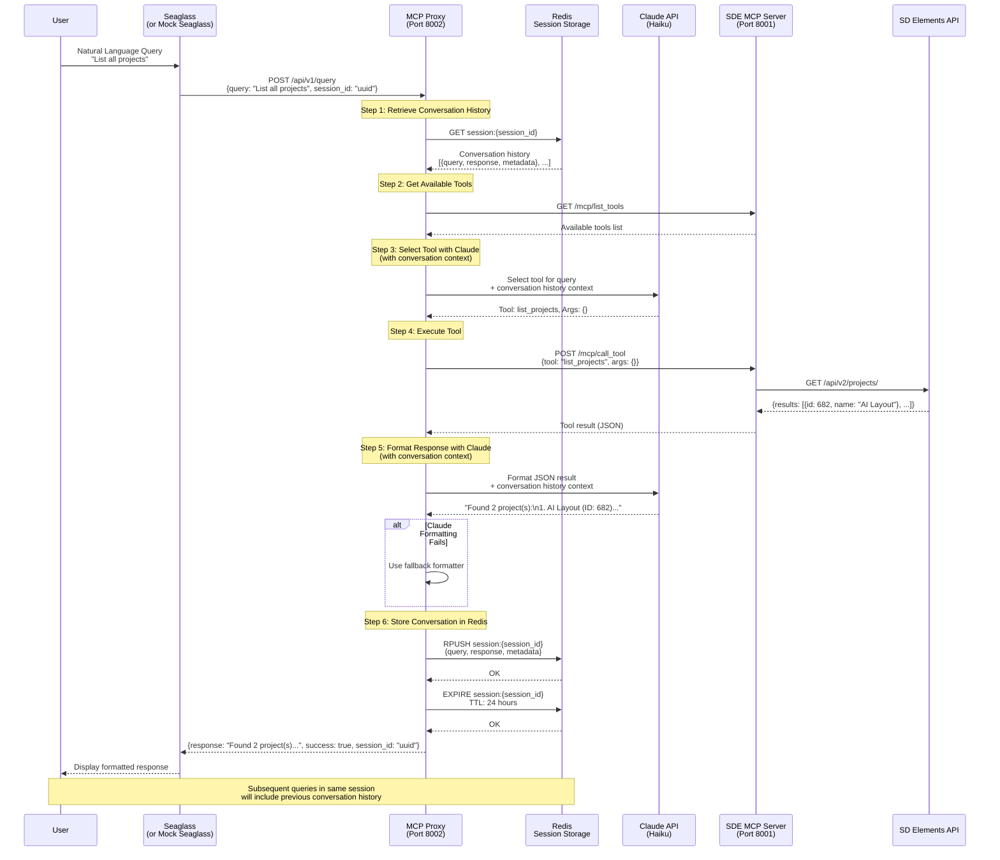

# Seaglass SDE MCP Integration Architecture Documentation

This document describes three architectural approaches for integrating the SDE MCP server into Seaglass, enabling users to interact with Seaglass and SD Elements via natural language queries.

## Overview

The goal is to integrate the SDE MCP server into Seaglass so users can interact with Seaglass/SDE using natural language queries. These queries are translated into MCP tool calls, executed against the SD Elements API, and returned as natural language responses within the Seaglass interface.

The integration enables Seaglass users to:
- Query SD Elements data using conversational language
- Maintain conversation context across multiple queries
- Access SD Elements functionality through Seaglass's natural language interface

## Architecture Options

### Option A: No Claude (Maximum Performance)

**Performance:** ~1-2 seconds (fastest)  
**Complexity:** High (requires NLU/intent mapping)  
**Cost:** Lowest (no LLM calls)

#### Architecture

```
Seaglass → MCP Proxy → Intent Mapper → MCP Server → SD Elements API
```

#### Implementation Approach

- Custom NLU/intent recognition system
- Pattern matching and entity extraction
- Direct tool invocation without LLM
- Template-based response formatting

#### Pros

- Fastest response time (~1-2s)
- Lowest cost (no LLM API calls)
- Predictable performance
- No external dependencies (beyond MCP server)

#### Cons

- Requires custom NLU/intent recognition
- Limited to predefined query patterns
- Brittle with complex or novel queries
- High maintenance burden (need to update patterns)
- Difficult to handle edge cases

#### When to Use

- High-volume, performance-critical scenarios
- Limited query patterns (e.g., specific command set)
- Cost-sensitive applications
- Environments where LLM APIs are not available

---

### Option B: Two Claude Calls (Current Implementation)

**Performance:** ~5-8 seconds  
**Complexity:** Low  
**Cost:** Highest (two LLM calls per query)

#### Architecture

```
Seaglass → MCP Proxy → Claude (Tool Selection) → MCP Server → SD Elements API
                                    ↓
                            Claude (Formatting) → Seaglass
                                    ↓
                            Fallback Formatter (if Claude fails)
```

#### Implementation Approach

1. First Claude call: Select tool and extract arguments from natural language query (with conversation history context)
2. Execute tool via MCP server
3. Second Claude call: Format JSON result into natural language (with conversation history context)
4. Fallback to local formatters if Claude formatting fails
5. Store conversation in Redis for context retention
6. Return formatted response to client

#### Pros

- Highest quality natural language responses
- Conversation context awareness (maintains history across queries)
- Consistent formatting across all tools
- Handles complex queries well
- Easy to maintain (Claude handles edge cases)
- Resilient fallback to local formatters if Claude fails
- Session-based conversation continuity

#### Cons

- Higher cost (two LLM calls per query)
- Slower than Option C (~5-8s vs ~3-5s)
- Requires Redis for session storage
- Double latency (two sequential API calls)

#### When to Use

- User-facing chat applications
- Response quality matters more than speed
- Applications requiring conversation context
- Prototyping and development
- **This is the current production implementation**

---

### Option C: Single Claude Call (Not Currently Implemented)

**Performance:** ~3-5 seconds (balanced)  
**Complexity:** Medium  
**Cost:** Moderate (one LLM call per query)

#### Architecture

```
Seaglass → MCP Proxy → Claude (Tool Selection) → MCP Server → SD Elements API
                                    ↓
                            Local Formatter → Seaglass
```

#### Implementation Approach

1. Single Claude call: Select tool and extract arguments from natural language query
2. Execute tool via MCP server
3. Local formatting: Use template-based formatters to convert JSON to natural language
4. Return formatted response to client

#### Pros

- Good balance of performance and quality (~3-5s)
- 50% cost reduction vs Option B (one Claude call)
- Faster than Option B while maintaining good UX
- Template-based formatting is maintainable
- Falls back to structured JSON for unknown tools

#### Cons

- Requires maintaining formatter templates
- Formatting quality may be slightly lower than Option B
- Need to add formatters for new tools

#### When to Use

- Production applications requiring good performance
- Moderate query volume
- Balance between cost and quality

---

## Trade-off Matrix

| Aspect | Option A (No Claude) | Option B (Two Claude) | Option C (Single Claude) |
|--------|---------------------|----------------------|-------------------------|
| **Performance** | ⭐⭐⭐⭐⭐ (1-2s) | ⭐⭐⭐ (5-8s) | ⭐⭐⭐⭐ (3-5s) |
| **Cost** | ⭐⭐⭐⭐⭐ (Lowest) | ⭐⭐ (Highest) | ⭐⭐⭐ (Moderate) |
| **Complexity** | ⭐ (High) | ⭐⭐⭐⭐⭐ (Low) | ⭐⭐⭐ (Medium) |
| **Maintainability** | ⭐⭐ (Low) | ⭐⭐⭐⭐⭐ (High) | ⭐⭐⭐⭐ (Good) |
| **Response Quality** | ⭐⭐ (Limited) | ⭐⭐⭐⭐⭐ (Best) | ⭐⭐⭐⭐ (Good) |
| **Flexibility** | ⭐⭐ (Low) | ⭐⭐⭐⭐⭐ (High) | ⭐⭐⭐⭐ (Good) |
| **Context Awareness** | ❌ (No) | ✅ (Yes, Redis-based) | ⚠️ (Limited) |

## Implementation Details

### Option B Implementation (Current)

The implemented solution uses Option B and consists of:

1. **MCP Proxy Service** (`mcp-proxy-service/`)
   - Receives natural language queries
   - Uses Claude (Haiku) for tool selection with conversation context
   - Executes tools via MCP server
   - Uses Claude for response formatting with conversation context
   - Falls back to local formatters if Claude formatting fails
   - Manages Redis-based session storage for conversation history

2. **SDE MCP Server** (`src/`)
   - Exposes SD Elements API as MCP tools
   - Supports both stdio and HTTP transport modes
   - HTTP server implementation (`src/httpServer.ts`) using `StreamableHTTPServerTransport`
   - Endpoints: `POST /mcp`, `GET /mcp` (SSE), `DELETE /mcp`, `GET /health`
   - Handles authentication and API calls
   - Session management with UUID-based session IDs
   - Graceful shutdown with cleanup handlers

3. **Redis Session Storage** (`mcp-proxy-service/app/redis_session.py`)
   - Stores conversation history per session
   - Configurable TTL (default: 24 hours)
   - Configurable max conversations per session (default: 50)
   - Enables context-aware queries across multiple interactions

4. **Seaglass Integration** (Production)
   - Seaglass service receives natural language queries from users
   - Forwards queries to MCP Proxy Service
   - Displays formatted responses to users
   - Maintains session IDs for conversation continuity
   - Handles user authentication and authorization

5. **Mock Seaglass** (`mock-seaglass/`) - *Development/Testing Only*
   - Simulates Seaglass service for testing
   - Forwards queries to MCP Proxy
   - Used for prototype development and testing

6. **Client UI** (`client-ui/`) - *Development/Testing Only*
   - Web interface for testing
   - Displays queries and responses
   - Maintains session IDs for conversation continuity
   - Used for prototype development and testing

### Performance Breakdown (Option B - Current)

- Tool list fetch: ~100ms (cached for 5 minutes)
- Redis session retrieval: ~10-50ms
- Claude tool selection: ~2-3s (using Haiku model, with conversation history)
- MCP tool execution: ~0.5-2s (depends on SD Elements API)
- Claude response formatting: ~2-3s (using Haiku model, with conversation history)
- Redis session storage: ~10-50ms
- Fallback formatting (if Claude fails): ~10ms
- **Total: ~5-8 seconds** (falls back to ~3-5s if Claude formatting fails)

### Request Flow Sequence Diagram

The following sequence diagram illustrates how a natural language query flows through the system with Redis-based conversation context:



### Cost Analysis

- Option A: $0 (no LLM calls)
- Option B: ~$0.01-0.02 per query (two Claude calls with context)
- Option C: ~$0.005-0.01 per query (one Claude call)

*Costs are approximate and depend on query complexity, model used, and conversation history length.*

### Session Management

The current implementation includes Redis-based session management:

- **Session IDs**: UUID-based identifiers for conversation continuity
- **Conversation History**: Stored in Redis with configurable TTL
- **Context Awareness**: Both tool selection and response formatting use conversation history
- **Storage**: Redis lists store conversation entries with metadata
- **Configuration**: 
  - `SESSION_TTL_HOURS`: How long sessions persist (default: 24 hours)
  - `SESSION_MAX_CONVERSATIONS`: Max conversations per session (default: 50)

## Seaglass Integration Path

### Current State (Prototype)
- Mock Seaglass service simulates the integration point
- Standalone services for testing and development
- Web UI for demonstration purposes

### Production Integration
The MCP Proxy Service will be integrated into Seaglass, replacing the mock service:

1. **Replace Mock Seaglass**: Integrate MCP Proxy directly into Seaglass service
2. **Endpoint Integration**: Replace `/api/v1/nlquery` endpoint in Seaglass with MCP Proxy integration
3. **Authentication**: Use existing Seaglass user authentication and authorization
4. **Session Management**: Leverage Seaglass session management alongside Redis-based conversation history
5. **UI Integration**: Display natural language responses within Seaglass interface

## Recommendations

1. **Current Production:** Option B (implemented with Redis session storage)
   - Best for Seaglass integration requiring conversation context
   - Highest quality responses for user-facing chat interface
   - Suitable for natural language interaction within Seaglass

2. **For Prototyping:** Use Option B (simplest, highest quality)
   - Current implementation provides best development experience
   - Easy to test and iterate

3. **For Cost Optimization:** Consider Option C (single Claude call)
   - Would require modifying implementation to skip Claude formatting
   - Use local formatters directly
   - Reduces cost by ~50% but may reduce response quality
   - May be suitable if Seaglass has its own formatting preferences

4. **For High-Volume:** Consider Option A (if query patterns are limited)
   - Requires custom NLU implementation
   - No conversation context support
   - May be suitable for specific Seaglass use cases with limited query types

## Future Enhancements

- **Seaglass UI Integration:** Deep integration with Seaglass UI components and styling
- **Hybrid Approach:** Use Option A for common queries, Option C for complex ones
- **Caching:** Cache tool selection results for identical queries
- **Streaming:** Stream responses for better perceived performance in Seaglass
- **Multi-tool Queries:** Support queries that require multiple tool calls
- **Session Analytics:** Track session metrics and conversation patterns within Seaglass
- **Adaptive Formatting:** Automatically choose between Claude and local formatters based on query complexity
- **Context Compression:** Summarize long conversation histories to reduce token usage
- **Seaglass-Specific Features:** Integration with Seaglass workflows, notifications, and user preferences
- **Access Control:** Leverage Seaglass permissions for SD Elements API access control

