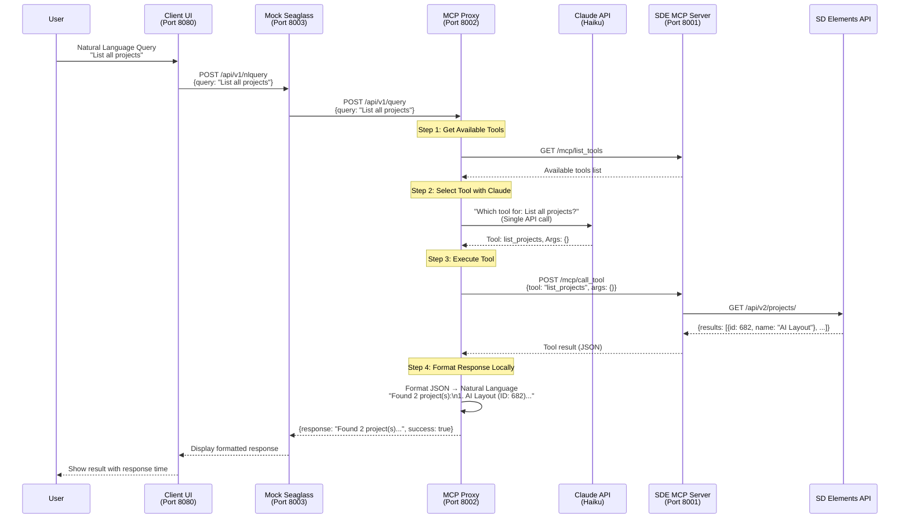
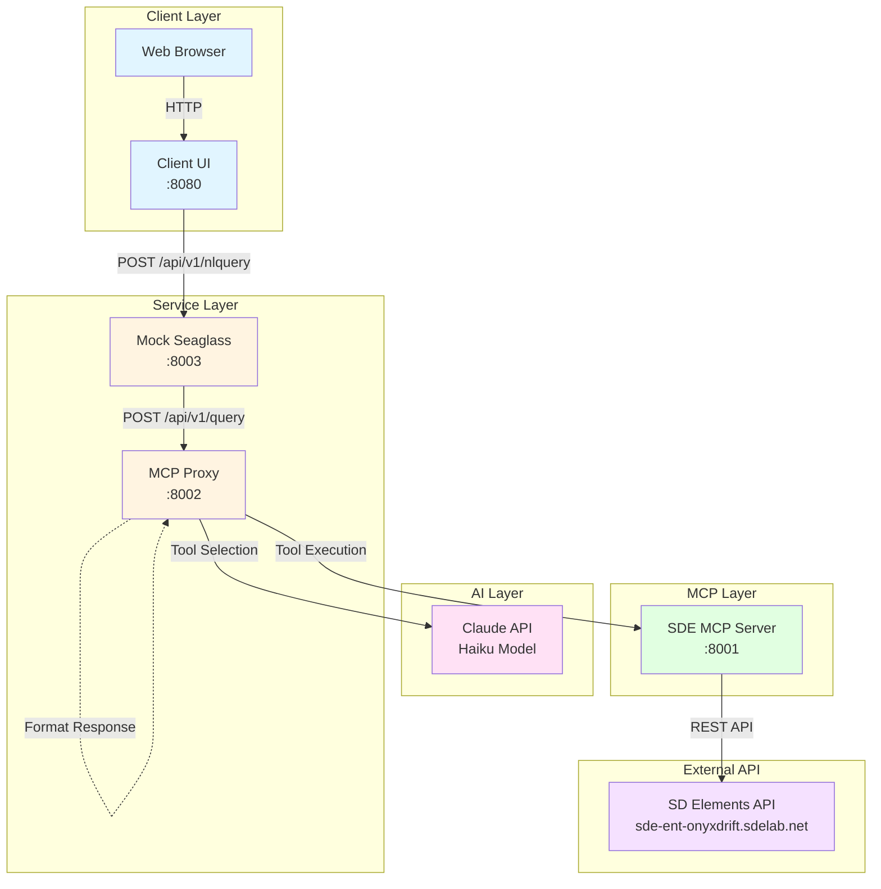

# Seaglass-SDE MCP Workflow

> **Note:** This document contains Mermaid diagrams. If the diagrams don't render in your markdown preview, try viewing this file on GitHub, using a Mermaid-compatible editor (like Typora, Obsidian, or VS Code with a Mermaid extension), or use the [Mermaid Live Editor](https://mermaid.live/) to view the diagram code.

## Architecture Diagram



## Component Flow



## Command-Line Instructions

### Prerequisites

1. **Docker and Docker Compose** installed and running
2. **SD Elements API credentials** (host URL and API key)
3. **Anthropic API key** (for Claude)

### Step 1: Clone and Setup

```bash
# Navigate to the repository
cd sde-mcp

# Checkout the feature branch
git checkout feature/poc-sea-sde-mcp-workflow

# Ensure you're on the correct branch
git branch
```

### Step 2: Configure Environment Variables

Create or edit `.env` file in the root directory:

```bash
# SD Elements API Configuration
SDE_HOST=https://your-instance.sdelements.com
SDE_API_KEY=your-sde-api-key-here

# Anthropic API Configuration (required)
ANTHROPIC_API_KEY=your-anthropic-api-key-here

# Optional: Claude Model (defaults to claude-3-5-haiku-20241022)
CLAUDE_MODEL=claude-3-5-haiku-20241022

# Optional: Enable timing output
ENABLE_TIMING=false
```

**Note:** The `.env` file is already in `.gitignore` and won't be committed.

### Step 3: Start All Services

```bash
# Build and start all services in detached mode
docker-compose up --build -d

# Verify all services are running
docker-compose ps
```

Expected output:
```
NAME                       STATUS          PORTS
sde-mcp-client-ui-1       Up              0.0.0.0:8080->8080/tcp
sde-mcp-mock-seaglass-1   Up              0.0.0.0:8003->8003/tcp
sde-mcp-mcp-proxy-1       Up              0.0.0.0:8002->8002/tcp
sde-mcp-sde-mcp-server-1  Up              0.0.0.0:8001->8001/tcp
```

### Step 4: Verify Services Are Healthy

```bash
# Check MCP Proxy health
curl http://localhost:8002/api/v1/health

# Check Mock Seaglass health
curl http://localhost:8003/api/v1/health

# Check Client UI (should return HTML)
curl http://localhost:8080 | head -20
```

### Step 5: Test via Command Line

#### Option A: Test via Mock Seaglass (Recommended)

```bash
# Using curl (Linux/Mac/Git Bash)
curl -X POST http://localhost:8003/api/v1/nlquery \
  -H "Content-Type: application/json" \
  -d '{"query": "List all projects"}'

# Using PowerShell (Windows)
$body = @{query='List all projects'} | ConvertTo-Json
Invoke-RestMethod -Uri http://localhost:8003/api/v1/nlquery `
  -Method Post -Body $body -ContentType 'application/json'
```

#### Option B: Test via MCP Proxy Directly

```bash
# Using curl
curl -X POST http://localhost:8002/api/v1/query \
  -H "Content-Type: application/json" \
  -d '{"query": "List all projects"}'

# Using PowerShell
$body = @{query='List all projects'} | ConvertTo-Json
Invoke-RestMethod -Uri http://localhost:8002/api/v1/query `
  -Method Post -Body $body -ContentType 'application/json'
```

#### Option C: Test via Web UI

1. Open your browser to `http://localhost:8080`
2. Click an example query or type your own
3. View the formatted response and response time

### Step 6: View Logs

```bash
# View all service logs
docker-compose logs -f

# View specific service logs
docker-compose logs -f mcp-proxy
docker-compose logs -f sde-mcp-server
docker-compose logs -f mock-seaglass

# View last 50 lines of a service
docker-compose logs --tail 50 mcp-proxy
```

### Step 7: Stop Services

```bash
# Stop all services
docker-compose down

# Stop and remove volumes (clean slate)
docker-compose down -v

# Stop services but keep containers
docker-compose stop
```

## Example Queries

Test these queries via the API or web UI:

```bash
# List all projects
{"query": "List all projects"}

# Get project details
{"query": "Get details for project 682"}

# List applications
{"query": "Show me all applications"}

# Get project by ID
{"query": "What is project 683?"}
```

## Troubleshooting

### Services Won't Start

```bash
# Check Docker is running
docker --version
docker-compose --version

# Check for port conflicts
netstat -an | grep -E "8001|8002|8003|8080"  # Linux/Mac
Get-NetTCPConnection | Where-Object {$_.LocalPort -in 8001,8002,8003,8080}  # Windows PowerShell

# View detailed error logs
docker-compose logs
```

### MCP Proxy Can't Connect to MCP Server

```bash
# Check MCP Server is running
docker-compose ps sde-mcp-server

# Check MCP Server logs
docker-compose logs sde-mcp-server

# Test MCP Server directly
curl http://localhost:8001/mcp
```

### Claude API Errors

```bash
# Verify API key is set
docker-compose exec mcp-proxy env | grep ANTHROPIC_API_KEY

# Check MCP Proxy logs for Claude errors
docker-compose logs mcp-proxy | grep -i claude
```

### No Projects Returned

```bash
# Verify SD Elements API credentials
docker-compose exec sde-mcp-server env | grep SDE_

# Test SD Elements API directly
curl -H "Authorization: Token YOUR_API_KEY" \
  https://your-instance.sdelements.com/api/v2/projects/
```

## Performance Testing

```bash
# Test response time
time curl -X POST http://localhost:8003/api/v1/nlquery \
  -H "Content-Type: application/json" \
  -d '{"query": "List all projects"}'

# Enable timing output (set ENABLE_TIMING=true in .env and restart)
docker-compose restart mcp-proxy
docker-compose logs -f mcp-proxy
```

## Development Mode

### Rebuild After Code Changes

```bash
# Rebuild specific service
docker-compose build mcp-proxy
docker-compose up -d mcp-proxy

# Rebuild all services
docker-compose build
docker-compose up -d
```

### Run Services Locally (Without Docker)

```bash
# Terminal 1: Start SDE MCP Server
cd sde-mcp
export SDE_HOST=https://your-instance.sdelements.com
export SDE_API_KEY=your-key
npm run build
npm start

# Terminal 2: Start MCP Proxy
cd mcp-proxy-service
export MCP_SERVER_URL=http://localhost:8001/mcp
export ANTHROPIC_API_KEY=your-key
uvicorn app.main:app --host 0.0.0.0 --port 8002

# Terminal 3: Start Mock Seaglass
cd mock-seaglass
export MCP_PROXY_URL=http://localhost:8002
uvicorn app.main:app --host 0.0.0.0 --port 8003

# Terminal 4: Start Client UI
cd client-ui/static
python -m http.server 8080
```

## Quick Reference

| Service | Port | Health Check | Purpose |
|---------|------|--------------|---------|
| Client UI | 8080 | `http://localhost:8080` | Web interface |
| Mock Seaglass | 8003 | `http://localhost:8003/api/v1/health` | Request forwarding |
| MCP Proxy | 8002 | `http://localhost:8002/api/v1/health` | Tool selection & formatting |
| SDE MCP Server | 8001 | `http://localhost:8001/mcp` | MCP tool execution |

## Next Steps

1. **Test the web UI:** Open `http://localhost:8080` and try example queries
2. **Test API endpoints:** Use curl or PowerShell to test the API directly
3. **Review logs:** Check service logs to understand the flow
4. **Customize formatters:** Edit `mcp-proxy-service/app/response_formatter.py` to add more formatters

