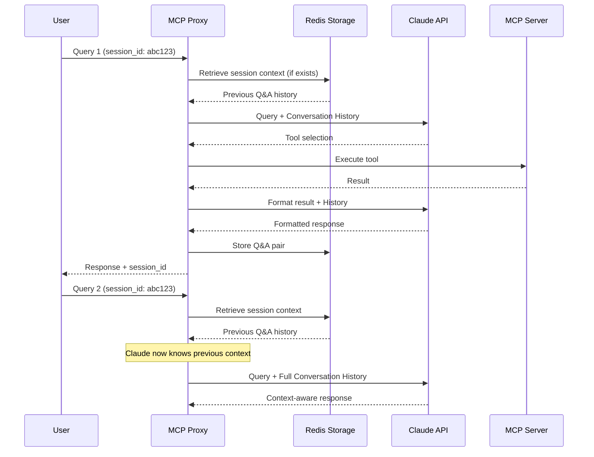

# Context Retention System Implementation

## Problem

The MCP proxy service currently processes each query independently with no memory of previous operations. When a tool execution mentions information (like "answers were deselected"), that context is lost for follow-up queries.

## Solution Overview

Implement per-session context retention that:
1. Stores session context in Docker Redis (in-memory key-value store)
2. Retrieves and provides conversation history to Claude on each query
3. Enables Claude to respond with awareness of previous questions and answers

## Architecture



## Implementation Steps

### 1. Add Redis to Docker Compose

**File: `docker-compose.yml`**

Add Redis service:
```yaml
  # Redis - In-memory storage for session context
  redis:
    image: redis:7-alpine
    ports:
      - "6379:6379"
    networks:
      - app-network
    restart: unless-stopped
    # Note: Persistence (RDB/AOF) can be added later if needed
```

Update `mcp-proxy` service to include Redis environment variables:
```yaml
    environment:
      - REDIS_HOST=redis
      - REDIS_PORT=6379
      - REDIS_DB=0
      - SESSION_TTL=86400
    depends_on:
      - sde-mcp-server
      - redis
```

### 2. Create Redis Storage Client

**File: `mcp-proxy-service/app/redis_client.py`** (new)

Create Redis client wrapper for session storage:
```python
import redis.asyncio as redis
import json
from typing import Optional, Dict, List
from datetime import datetime

class RedisSessionStorage:
    """Store and retrieve session context from Redis"""
    
    def __init__(self, host: str, port: int, db: int = 0, session_ttl: int = 86400):
        self.client = redis.Redis(
            host=host,
            port=port,
            db=db,
            decode_responses=True
        )
        self.session_ttl = session_ttl  # Default 24 hours
    
    async def get_session_context(self, session_id: str) -> Optional[Dict]:
        """Retrieve session context from Redis"""
        key = f"session:{session_id}"
        data = await self.client.get(key)
        if data:
            return json.loads(data)
        return None
    
    async def save_session_context(self, session_id: str, context: Dict) -> None:
        """Save session context to Redis with TTL"""
        key = f"session:{session_id}"
        data = json.dumps(context, default=str)
        await self.client.setex(key, self.session_ttl, data)
    
    async def append_conversation(
        self, 
        session_id: str, 
        query: str, 
        response: str, 
        metadata: Dict
    ) -> None:
        """Append Q&A pair to session conversation history"""
        context = await self.get_session_context(session_id) or {
            "session_id": session_id,
            "created_at": datetime.utcnow().isoformat(),
            "conversations": []
        }
        
        context["conversations"].append({
            "timestamp": datetime.utcnow().isoformat(),
            "query": query,
            "response": response,
            "metadata": metadata
        })
        
        # Keep last 50 conversations per session
        if len(context["conversations"]) > 50:
            context["conversations"] = context["conversations"][-50:]
        
        context["updated_at"] = datetime.utcnow().isoformat()
        await self.save_session_context(session_id, context)
    
    async def delete_session(self, session_id: str) -> None:
        """Delete a session from Redis"""
        key = f"session:{session_id}"
        await self.client.delete(key)
    
    async def close(self) -> None:
        """Close Redis connection"""
        await self.client.close()
```

### 3. Update Configuration

**File: `mcp-proxy-service/app/config.py`**

Add Redis configuration:
```python
    # Redis Configuration
    REDIS_HOST = os.getenv("REDIS_HOST", "localhost")
    REDIS_PORT = int(os.getenv("REDIS_PORT", "6379"))
    REDIS_DB = int(os.getenv("REDIS_DB", "0"))
    
    # Session Configuration
    SESSION_TTL = int(os.getenv("SESSION_TTL", "86400"))  # 24 hours in seconds
    SESSION_MAX_CONVERSATIONS = int(os.getenv("SESSION_MAX_CONVERSATIONS", "50"))
```

### 4. Update Models

**File: `mcp-proxy-service/app/models.py`**

Add session_id to request/response:
```python
from typing import Optional

class QueryRequest(BaseModel):
    query: str = Field(..., description="Natural language query", min_length=1)
    session_id: Optional[str] = Field(None, description="Session ID for context retention")

class QueryResponse(BaseModel):
    response: str = Field(..., description="Formatted natural language response")
    success: bool = Field(..., description="Whether the query was successful")
    session_id: str = Field(..., description="Session ID for this conversation")
    tool_name: str | None = Field(None, description="Name of the tool that was called")
    error: str | None = Field(None, description="Error message if unsuccessful")
```

### 5. Modify Claude Adapter for Conversation History

**File: `mcp-proxy-service/app/claude_adapter.py`**

Update `select_tool` method to accept and use conversation history:
```python
from typing import List, Dict, Optional

async def select_tool(
    self, 
    query: str, 
    available_tools: list,
    conversation_history: Optional[List[Dict]] = None
) -> Tuple[str, dict]:
    """Use Claude to determine which tool to call with conversation context"""
    
    # Build messages list with conversation history
    messages = []
    
    # Add previous conversation history
    if conversation_history:
        for conv in conversation_history:
            messages.append({
                "role": "user",
                "content": conv.get("query", "")
            })
            messages.append({
                "role": "assistant",
                "content": conv.get("response", "")
            })
    
    # Add current query
    tools_description = self._format_tools_for_claude(available_tools)
    user_prompt = f"""Available tools:
{tools_description}

User query: {query}

Respond with JSON only:"""
    
    messages.append({"role": "user", "content": user_prompt})
    
    # Update system prompt to mention context awareness
    system_prompt = """You are a tool selector for SD Elements operations.
You have access to the conversation history above, which shows previous questions and answers in this session.
Use this context to better understand follow-up questions and references to previous operations.

Given a user's natural language query, determine which tool should be called and with what arguments.

CRITICAL TOOL SELECTION RULES:

1. LIST vs CREATE REPORT (MOST IMPORTANT):
   - If the query asks to "list", "show", "get", "find", or "display" items → Use list_* tools
   - If the query explicitly asks to "create a report" or "generate a report" → Use create_advanced_report
   - NEVER use create_advanced_report for simple list queries, even if filtering is needed
   - For filtered lists (e.g., "projects that are not risk compliant"), use list_projects and filter results client-side
   - Examples:
     * "list projects that are not risk compliant" → list_projects (NOT create_advanced_report)
     * "show me all business units" → list_business_units
     * "create a risk compliance report" → create_advanced_report
     * "list projects created this month" → list_projects

2. TOOL PRIORITY:
   - Prefer list_* tools for retrieval queries (list, show, get all, find all)
   - Only use create_* tools when explicitly creating something new (create project, create report)
   - Use get_* tools for single item retrieval by ID (get project 123)
   - Use update_* tools for modifying existing items
   - Use delete_* tools for removing items

3. CONTEXT AWARENESS:
   - If the user references a previous operation (e.g., "the project I just created", "those answers"), use the conversation history to understand what they're referring to
   - For follow-up questions, consider what tool was used in previous queries to maintain context

4. You must respond with ONLY a JSON object in this exact format:
{
    "tool_name": "name_of_tool",
    "arguments": {
        "arg1": "value1",
        "arg2": "value2"
    }
}

5. If no tool matches the query, return:
{
    "tool_name": null,
    "arguments": {},
    "error": "No matching tool found"
}

6. Only provide arguments that are explicitly mentioned in the query or that you can reasonably infer. Do not make up values for required parameters unless you can infer them."""
    
    response = self.anthropic.messages.create(
        model=self.tool_selection_model,
        max_tokens=1000,
        system=system_prompt,
        messages=messages
    )
    # ... rest of existing code for parsing response
```

### 6. Modify Claude Formatter for Conversation History

**File: `mcp-proxy-service/app/claude_formatter.py`**

Update `format_result` method to include conversation history:
```python
from typing import List, Dict, Optional

async def format_result(
    self, 
    tool_name: str, 
    result: Dict[str, Any], 
    original_query: str,
    conversation_history: Optional[List[Dict]] = None
) -> str:
    """Format result with conversation context"""
    
    # Build messages with history
    messages = []
    
    if conversation_history:
        for conv in conversation_history:
            messages.append({
                "role": "user",
                "content": conv.get("query", "")
            })
            messages.append({
                "role": "assistant",
                "content": conv.get("response", "")
            })
    
    # Add current formatting request
    result_json = json.dumps(result, indent=2)
    user_prompt = f"""Tool: {tool_name}
Original user query: {original_query}

Tool result (JSON):
{result_json}

Format this result into natural language. Consider the conversation history above for context:"""
    
    messages.append({"role": "user", "content": user_prompt})
    
    # Update system prompt
    system_prompt = """You are a response formatter for SD Elements operations.
You have access to the conversation history above. Use this context to provide more relevant and contextual responses.

Guidelines:
- Be concise but informative
- Highlight key information (IDs, names, URLs, status)
- For lists, show count and key details for each item
- For errors, clearly explain what went wrong
- Use a friendly, professional tone
- Format dates/timestamps in a readable way
- Include relevant URLs when available
- Reference previous operations when relevant (e.g., "As mentioned earlier, 3 answers were deselected")

Respond with ONLY the formatted natural language text, no additional commentary."""
    
    loop = asyncio.get_event_loop()
    response = await loop.run_in_executor(
        None,
        lambda: self.anthropic.messages.create(
            model=self.model,
            max_tokens=2000,
            system=system_prompt,
            messages=messages
        )
    )
    
    return response.content[0].text
```

### 7. Update Main Application

**File: `mcp-proxy-service/app/main.py`**

Modify `/api/v1/query` endpoint:
```python
from app.redis_client import RedisSessionStorage
import uuid

# Initialize Redis storage in lifespan
redis_storage: RedisSessionStorage | None = None

@asynccontextmanager
async def lifespan(app: FastAPI):
    global mcp_client, claude_selector, claude_formatter, fallback_formatter, redis_storage
    
    # ... existing initialization ...
    
    # Initialize Redis storage
    redis_storage = RedisSessionStorage(
        host=Config.REDIS_HOST,
        port=Config.REDIS_PORT,
        db=Config.REDIS_DB,
        session_ttl=Config.SESSION_TTL
    )
    logger.info(f"Initialized Redis storage at {Config.REDIS_HOST}:{Config.REDIS_PORT}")
    
    yield
    
    # Cleanup
    if redis_storage:
        await redis_storage.close()

@app.post("/api/v1/query", response_model=QueryResponse)
async def process_query(request: QueryRequest):
    # Generate or use provided session_id
    session_id = request.session_id or str(uuid.uuid4())
    
    # Retrieve conversation history from Redis
    session_context = await redis_storage.get_session_context(session_id) if redis_storage else None
    conversation_history = session_context.get("conversations", []) if session_context else []
    
    # Get available tools
    tools = await mcp_client.get_tools()
    
    if not tools:
        return QueryResponse(
            response="No tools available from MCP server",
            success=False,
            error="No tools available",
            session_id=session_id
        )
    
    # Pass conversation history to Claude selector
    try:
        tool_name, arguments = await claude_selector.select_tool(
            request.query, 
            tools,
            conversation_history=conversation_history
        )
    except ValueError as e:
        return QueryResponse(
            response=str(e),
            success=False,
            error=str(e),
            tool_name=None,
            session_id=session_id
        )
    
    # Call the tool
    try:
        result = await mcp_client.call_tool(tool_name, arguments)
    except Exception as e:
        logger.error(f"Tool call failed: {e}")
        return QueryResponse(
            response=f"Failed to execute tool '{tool_name}': {str(e)}",
            success=False,
            error=str(e),
            tool_name=tool_name,
            session_id=session_id
        )
    
    # Pass conversation history to Claude formatter
    try:
        formatted_response = await claude_formatter.format_result(
            tool_name=tool_name,
            result=result,
            original_query=request.query,
            conversation_history=conversation_history
        )
    except Exception as e:
        logger.warning(f"Claude formatting failed, using fallback: {e}")
        formatted_response = fallback_formatter.format_tool_result(tool_name, result)
    
    # Store conversation in Redis
    if redis_storage:
        await redis_storage.append_conversation(
            session_id=session_id,
            query=request.query,
            response=formatted_response,
            metadata={
                "tool_name": tool_name,
                "success": True
            }
        )
    
    return QueryResponse(
        response=formatted_response,
        success=True,
        session_id=session_id,
        tool_name=tool_name
    )
```

### 8. Add Dependencies

**File: `mcp-proxy-service/requirements.txt`**

Add Redis client:
```
redis>=5.0.0
```

### 9. Update Environment Example

**File: `env.example`**

Add Redis configuration:
```
# Redis Configuration (for session context storage)
REDIS_HOST=localhost
REDIS_PORT=6379
REDIS_DB=0
SESSION_TTL=86400
SESSION_MAX_CONVERSATIONS=50
```

### 10. Add Tests for Redis Client

**File: `mcp-proxy-service/tests/test_redis_client.py`** (new)

Create comprehensive tests for RedisSessionStorage:
```python
import pytest
import asyncio
from datetime import datetime
from app.redis_client import RedisSessionStorage

# Use a separate Redis DB for testing (e.g., DB 1)
TEST_REDIS_HOST = "localhost"
TEST_REDIS_PORT = 6379
TEST_REDIS_DB = 1
TEST_SESSION_TTL = 60  # 1 minute for testing

@pytest.fixture
async def redis_storage():
    """Create Redis storage instance for testing"""
    storage = RedisSessionStorage(
        host=TEST_REDIS_HOST,
        port=TEST_REDIS_PORT,
        db=TEST_REDIS_DB,
        session_ttl=TEST_SESSION_TTL
    )
    yield storage
    # Cleanup: close connection after tests
    await storage.close()

@pytest.fixture
async def cleanup_test_sessions(redis_storage):
    """Cleanup test sessions before and after each test"""
    # Cleanup before test
    yield
    # Cleanup after test - delete all test sessions
    # Note: In a real scenario, you might want to use a test prefix
    pass

@pytest.mark.asyncio
async def test_get_session_context_nonexistent(redis_storage):
    """Test retrieving non-existent session returns None"""
    result = await redis_storage.get_session_context("nonexistent-session")
    assert result is None

@pytest.mark.asyncio
async def test_save_and_get_session_context(redis_storage):
    """Test saving and retrieving session context"""
    session_id = "test-session-1"
    context = {
        "session_id": session_id,
        "created_at": datetime.utcnow().isoformat(),
        "conversations": []
    }
    
    await redis_storage.save_session_context(session_id, context)
    retrieved = await redis_storage.get_session_context(session_id)
    
    assert retrieved is not None
    assert retrieved["session_id"] == session_id
    assert "created_at" in retrieved
    assert retrieved["conversations"] == []
    
    # Cleanup
    await redis_storage.delete_session(session_id)

@pytest.mark.asyncio
async def test_append_conversation_new_session(redis_storage):
    """Test appending conversation to a new session"""
    session_id = "test-session-2"
    query = "List all projects"
    response = "Found 2 projects"
    metadata = {"tool_name": "list_projects", "success": True}
    
    await redis_storage.append_conversation(session_id, query, response, metadata)
    context = await redis_storage.get_session_context(session_id)
    
    assert context is not None
    assert len(context["conversations"]) == 1
    assert context["conversations"][0]["query"] == query
    assert context["conversations"][0]["response"] == response
    assert context["conversations"][0]["metadata"] == metadata
    assert "timestamp" in context["conversations"][0]
    
    # Cleanup
    await redis_storage.delete_session(session_id)

@pytest.mark.asyncio
async def test_append_conversation_existing_session(redis_storage):
    """Test appending multiple conversations to existing session"""
    session_id = "test-session-3"
    
    # First conversation
    await redis_storage.append_conversation(
        session_id, 
        "Query 1", 
        "Response 1", 
        {"tool": "tool1"}
    )
    
    # Second conversation
    await redis_storage.append_conversation(
        session_id, 
        "Query 2", 
        "Response 2", 
        {"tool": "tool2"}
    )
    
    context = await redis_storage.get_session_context(session_id)
    
    assert context is not None
    assert len(context["conversations"]) == 2
    assert context["conversations"][0]["query"] == "Query 1"
    assert context["conversations"][1]["query"] == "Query 2"
    
    # Cleanup
    await redis_storage.delete_session(session_id)

@pytest.mark.asyncio
async def test_conversation_limit(redis_storage):
    """Test that conversations are limited to max (50)"""
    session_id = "test-session-4"
    
    # Add 55 conversations (should keep only last 50)
    for i in range(55):
        await redis_storage.append_conversation(
            session_id,
            f"Query {i}",
            f"Response {i}",
            {"index": i}
        )
    
    context = await redis_storage.get_session_context(session_id)
    
    assert context is not None
    assert len(context["conversations"]) == 50
    # Should keep the last 50 (indices 5-54)
    assert context["conversations"][0]["query"] == "Query 5"
    assert context["conversations"][-1]["query"] == "Query 54"
    
    # Cleanup
    await redis_storage.delete_session(session_id)

@pytest.mark.asyncio
async def test_session_isolation(redis_storage):
    """Test that different sessions don't interfere with each other"""
    session_id_1 = "test-session-5"
    session_id_2 = "test-session-6"
    
    await redis_storage.append_conversation(
        session_id_1, 
        "Session 1 Query", 
        "Session 1 Response", 
        {}
    )
    
    await redis_storage.append_conversation(
        session_id_2, 
        "Session 2 Query", 
        "Session 2 Response", 
        {}
    )
    
    context_1 = await redis_storage.get_session_context(session_id_1)
    context_2 = await redis_storage.get_session_context(session_id_2)
    
    assert context_1 is not None
    assert context_2 is not None
    assert len(context_1["conversations"]) == 1
    assert len(context_2["conversations"]) == 1
    assert context_1["conversations"][0]["query"] == "Session 1 Query"
    assert context_2["conversations"][0]["query"] == "Session 2 Query"
    
    # Cleanup
    await redis_storage.delete_session(session_id_1)
    await redis_storage.delete_session(session_id_2)

@pytest.mark.asyncio
async def test_delete_session(redis_storage):
    """Test deleting a session"""
    session_id = "test-session-7"
    
    await redis_storage.append_conversation(
        session_id, 
        "Test Query", 
        "Test Response", 
        {}
    )
    
    # Verify session exists
    context = await redis_storage.get_session_context(session_id)
    assert context is not None
    
    # Delete session
    await redis_storage.delete_session(session_id)
    
    # Verify session is deleted
    context_after = await redis_storage.get_session_context(session_id)
    assert context_after is None

@pytest.mark.asyncio
async def test_ttl_expiration(redis_storage):
    """Test that sessions expire after TTL"""
    session_id = "test-session-8"
    short_ttl_storage = RedisSessionStorage(
        host=TEST_REDIS_HOST,
        port=TEST_REDIS_PORT,
        db=TEST_REDIS_DB,
        session_ttl=2  # 2 seconds
    )
    
    await short_ttl_storage.append_conversation(
        session_id, 
        "Test Query", 
        "Test Response", 
        {}
    )
    
    # Verify session exists immediately
    context = await short_ttl_storage.get_session_context(session_id)
    assert context is not None
    
    # Wait for TTL to expire
    await asyncio.sleep(3)
    
    # Verify session has expired
    context_after = await short_ttl_storage.get_session_context(session_id)
    assert context_after is None
    
    await short_ttl_storage.close()
```

**File: `mcp-proxy-service/tests/conftest.py`** (update if exists, or create)

Add pytest configuration for async tests:
```python
import pytest

# Configure pytest for async tests
@pytest.fixture(scope="session")
def event_loop():
    """Create an instance of the default event loop for the test session."""
    import asyncio
    loop = asyncio.get_event_loop_policy().new_event_loop()
    yield loop
    loop.close()
```

**File: `mcp-proxy-service/pytest.ini`** (create if doesn't exist)

Add pytest configuration:
```ini
[pytest]
asyncio_mode = auto
testpaths = tests
python_files = test_*.py
python_classes = Test*
python_functions = test_*
```

**File: `mcp-proxy-service/requirements-dev.txt`** (update or create)

Add test dependencies:
```
pytest>=7.4.0
pytest-asyncio>=0.21.0
```

## Key Changes Summary

1. **Redis Integration**: Replace MinIO with Redis for in-memory session storage
2. **Conversation History**: Store Q&A pairs per session in Redis with TTL
3. **Claude Context**: Pass conversation history to both tool selection and response formatting
4. **Session Management**: Generate/use session_id, retrieve context before each query
5. **Automatic Expiration**: Sessions expire after TTL (default 24 hours)

## Benefits

- **Fast Access**: Redis provides sub-millisecond latency for session data
- **Automatic Cleanup**: TTL ensures old sessions are automatically removed
- **Context-Aware Responses**: Claude understands previous Q&A
- **Session Isolation**: Each session maintains its own conversation history
- **Docker-Based**: Easy to deploy and manage with docker-compose
- **Simple Setup**: No persistence configuration needed initially

## Example Usage

**First Query:**
```
User: "Add C++ and Python answers to project 123 survey"
Response: "Added 8 answers to the survey. 3 conflicting answers were automatically deselected."
Session ID: abc123
```

**Follow-up Query (using same session):**
```
User: "What answers were deselected?"
→ Claude receives conversation history showing previous query and response
→ Claude understands the context and can reference the deselected answers
Response: "The following answers were deselected: A2297 (Java), A2298 (Ruby), A2304 (Go)"
```

## Files to Modify

1. **New Files:**
   - `mcp-proxy-service/app/redis_client.py` (Redis storage client)
   - `mcp-proxy-service/tests/test_redis_client.py` (Redis client unit tests)
   - `mcp-proxy-service/pytest.ini` (Pytest configuration)

2. **Modified Files:**
   - `docker-compose.yml` (add Redis service)
   - `mcp-proxy-service/app/models.py` (add session_id fields)
   - `mcp-proxy-service/app/main.py` (integrate Redis, pass context to Claude)
   - `mcp-proxy-service/app/config.py` (add Redis config)
   - `mcp-proxy-service/app/claude_adapter.py` (accept conversation_history)
   - `mcp-proxy-service/app/claude_formatter.py` (accept conversation_history)
   - `mcp-proxy-service/requirements.txt` (add redis package)
   - `mcp-proxy-service/requirements-dev.txt` (add pytest and pytest-asyncio)
   - `mcp-proxy-service/tests/conftest.py` (add async test configuration)
   - `env.example` (add Redis configuration)

## Testing Strategy

### Unit Tests for Redis Client

Run Redis client unit tests:
```bash
# Ensure Redis is running
docker-compose up -d redis

# Run tests
cd mcp-proxy-service
pytest tests/test_redis_client.py -v
```

The test suite covers:
- Session context retrieval (nonexistent and existing)
- Saving and retrieving session context
- Appending conversations to new and existing sessions
- Conversation limit enforcement (max 50)
- Session isolation (different sessions don't interfere)
- Session deletion
- TTL expiration

### Integration Tests

1. Start Redis service: `docker-compose up redis`
2. Test session creation and storage via API
3. Test conversation history retrieval via API
4. Verify Claude receives and uses conversation history
5. Test session isolation (different sessions don't interfere)
6. Test TTL expiration (sessions expire after configured time)

## Future Enhancements

- **Persistence Options**: Add RDB snapshots or AOF logging for data durability across restarts
- Session expiration/TTL cleanup (already implemented via TTL)
- Session sharing across multiple users (with authentication)
- Export session history for audit/debugging
- Session search and analytics
- Compression for large conversation histories
- Redis Cluster support for high availability
