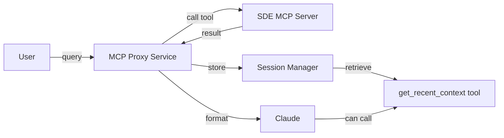

# Context Retention System Implementation

## Problem

The MCP proxy service currently processes each query independently with no memory of previous operations. When a tool execution mentions information (like "answers were deselected"), that context is lost for follow-up queries.

## Architecture




## Solution Components

### 1. Session Manager (`mcp-proxy-service/app/session_manager.py`)

Create a new session management module that:

- Stores operation history in memory (with configurable retention)
- Tracks each query execution with metadata
- Provides methods to retrieve recent context
- Supports session IDs for multi-conversation tracking

**Key Data Structure:**

```python
@dataclass
class OperationRecord:
    timestamp: datetime
    session_id: str
    query: str
    tool_name: str
    arguments: dict
    result: dict  # Parsed JSON result
    metadata: dict  # Extracted key info (e.g., deselected_answers, created_ids)
```

**Storage Strategy:**

- In-memory storage with LRU eviction
- Keep last 50 operations per session (configurable)
- Optional: TTL-based expiration (1 hour default)
- Future: Redis backend for persistence across restarts

### 2. Metadata Extraction (`mcp-proxy-service/app/metadata_extractor.py`)

Create utility to extract key information from tool results:

- For survey operations: track selected/deselected answer IDs and texts
- For project operations: track created project IDs, application IDs
- For countermeasure updates: track status changes, affected countermeasures
- Generic extraction for common patterns (IDs, counts, errors)

**Example Extraction:**

```python
{
  "deselected_answers": ["A2297", "A2298"],
  "selected_answers": ["A2300", "A2301"],
  "created_project_id": 12345,
  "affected_countermeasures": ["T21", "T42"]
}
```


### 3. Update Proxy Service (`mcp-proxy-service/app/main.py`)

Modify the `/api/v1/query` endpoint to:

1. Accept optional `session_id` parameter (generate if not provided)
2. Store each operation in SessionManager after execution
3. Extract and store metadata from results
4. Return `session_id` in the response

**Updated QueryRequest model:**

```python
class QueryRequest(BaseModel):
    query: str
    session_id: Optional[str] = None  # Auto-generated if not provided
```

**Updated QueryResponse model:**

```python
class QueryResponse(BaseModel):
    response: str
    success: bool
    session_id: str  # Always returned
    tool_name: Optional[str] = None
    error: Optional[str] = None
```


### 4. New MCP Tool (`src/sde_mcp_server/tools/context.py`)

Add a new tool to the MCP server for querying recent context:

```python
@mcp.tool()
async def get_recent_context(
    ctx: Context,
    session_id: Optional[str] = None,
    limit: int = 5,
    tool_filter: Optional[str] = None
) -> str:
    """
    Get recent operation history and context.
    
    Useful for answering follow-up questions about previous operations.
    
    Args:
        session_id: Optional session ID (uses current session if not provided)
        limit: Number of recent operations to return (default: 5)
        tool_filter: Optional tool name to filter by (e.g., "set_project_survey_by_text")
    
    Returns:
        JSON with recent operations and their metadata
    """
```

This tool will make an HTTP request to the proxy service's session endpoint.

### 5. Session Endpoint (`mcp-proxy-service/app/main.py`)

Add a new endpoint for retrieving session context:

```python
@app.get("/api/v1/sessions/{session_id}/context")
async def get_session_context(
    session_id: str,
    limit: int = 5,
    tool_filter: Optional[str] = None
):
    """Get recent context for a session"""
```


### 6. Configuration (`mcp-proxy-service/app/config.py`)

Add session management configuration:

```python
SESSION_MAX_OPERATIONS = 50  # Per session
SESSION_TTL_HOURS = 1  # Expiration time
SESSION_ENABLE_PERSISTENCE = False  # Redis backend (future)
```


## Implementation Order

1. Create `SessionManager` class with in-memory storage
2. Create `MetadataExtractor` utility
3. Update `QueryRequest` and `QueryResponse` models
4. Integrate SessionManager into `/api/v1/query` endpoint
5. Add `/api/v1/sessions/{session_id}/context` endpoint
6. Create `get_recent_context` MCP tool
7. Update tool imports in `tools/__init__.py`
8. Test with survey operations to verify context retention

## Example Usage

**First Query:**

```
User: "Add C++ and Python answers to project 123 survey"
Response: "Added 8 answers to the survey. 3 conflicting answers were automatically deselected."
Session ID: abc123
```

**Follow-up Query (using same session):**

```
User: "What answers were deselected?"
→ Claude calls get_recent_context(session_id="abc123", tool_filter="set_project_survey_by_text")
→ Returns: {"deselected_answers": ["A2297", "A2298", "A2304"], ...}
Response: "The following answers were deselected: A2297 (Java), A2298 (Ruby), A2304 (Go)"
```


## Files to Modify

1. **New Files:**

- `mcp-proxy-service/app/session_manager.py` (SessionManager class)
- `mcp-proxy-service/app/metadata_extractor.py` (metadata extraction utilities)
- `src/sde_mcp_server/tools/context.py` (get_recent_context tool)

2. **Modified Files:**

- `mcp-proxy-service/app/models.py` (add session_id fields)
- `mcp-proxy-service/app/main.py` (integrate SessionManager, add endpoint)
- `mcp-proxy-service/app/config.py` (add session config)
- `src/sde_mcp_server/tools/__init__.py` (import context tools)

## Testing Strategy

1. Start with survey operations that have clear metadata (selected/deselected answers)
2. Test follow-up queries asking about previous operation details
3. Verify session isolation (different sessions don't interfere)
4. Test with multiple tool types (projects, countermeasures, surveys)
5. Verify metadata extraction accuracy for each tool type

## Future Enhancements

- Redis backend for persistence across service restarts
- Session sharing across multiple users (with authentication)
- Webhook notifications for long-running operations
- Export session history for audit/debugging
