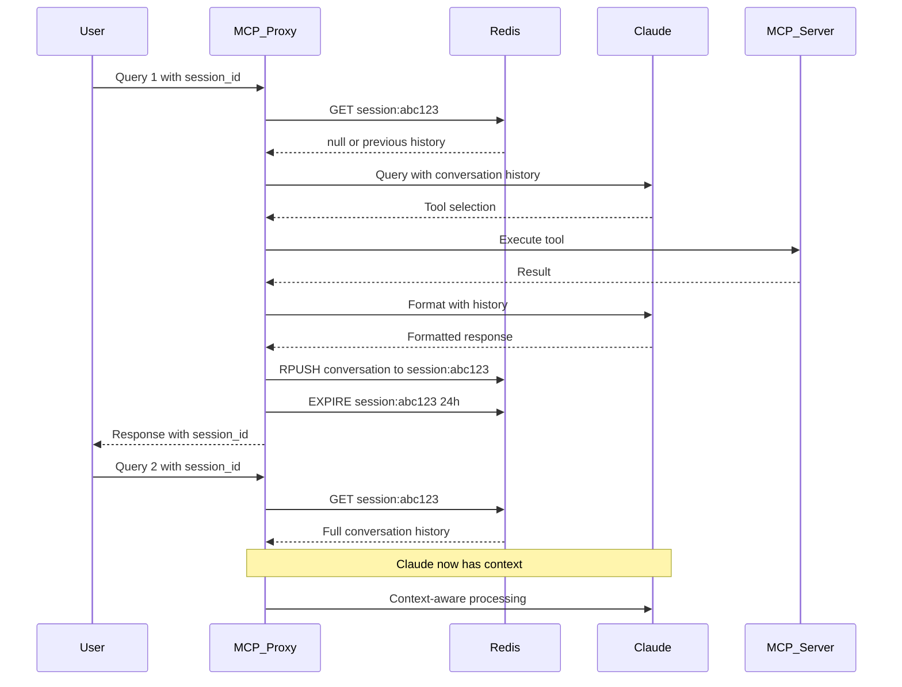

# Context Retention System Implementation

## Problem

The MCP proxy service currently processes each query independently with no memory of previous operations. When a tool execution mentions information (like "answers were deselected"), that context is lost for follow-up queries.

## Solution Overview

Implement per-session context retention that:
1. Stores session context in Redis (in-memory key-value store)
2. Retrieves and provides conversation history to Claude on each query
3. Enables Claude to respond with awareness of previous questions and answers

## Why Redis Over MinIO

- **Lower Latency**: In-memory storage (<1ms) vs object storage (10-50ms)
- **Built-in TTL**: Automatic session expiration with `EXPIRE` command
- **Simpler Operations**: No bucket management, native list operations
- **Native Data Structures**: Redis Lists perfect for ordered conversation history
- **Lightweight**: Easier to deploy and maintain
- **Better Performance**: Optimized for frequent read/write operations

## Architecture


```mermaid
sequenceDiagram
    participant User
    participant Proxy as MCP_Proxy
    participant Redis
    participant Claude
    participant MCP as MCP_Server

    User->>Proxy: Query 1 with session_id
    Proxy->>Redis: GET session:abc123
    Redis-->>Proxy: null or previous history
    Proxy->>Claude: Query with conversation history
    Claude-->>Proxy: Tool selection
    Proxy->>MCP: Execute tool
    MCP-->>Proxy: Result
    Proxy->>Claude: Format with history
    Claude-->>Proxy: Formatted response
    Proxy->>Redis: RPUSH conversation to session:abc123
    Proxy->>Redis: EXPIRE session:abc123 24h
    Proxy-->>User: Response with session_id

    User->>Proxy: Query 2 with session_id
    Proxy->>Redis: GET session:abc123
    Redis-->>Proxy: Full conversation history
    Note over Proxy,Claude: Claude now has context
    Proxy->>Claude: Context-aware processing
```

## Implementation Steps

### 1. Add Redis to Docker Compose

**File: `docker-compose.yml`**

Add Redis service after the `sde-mcp-server` service:

```yaml
  # Redis - In-memory storage for session context
  redis:
    image: redis:7-alpine
    ports:
      - "6379:6379"
    command: redis-server --maxmemory 256mb --maxmemory-policy allkeys-lru
    volumes:
      - redis-data:/data
    networks:
      - app-network
    restart: unless-stopped
    healthcheck:
      test: ["CMD", "redis-cli", "ping"]
      interval: 10s
      timeout: 3s
      retries: 3

volumes:
  redis-data:
```

Update `mcp-proxy` service to include Redis environment variables and dependency:

```yaml
    environment:
      - MCP_SERVER_URL=http://sde-mcp-server:8001/mcp
      - ANTHROPIC_API_KEY=${ANTHROPIC_API_KEY}
      - CLAUDE_MODEL=${CLAUDE_MODEL:-claude-3-5-haiku-20241022}
      - ENABLE_TIMING=${ENABLE_TIMING:-false}
      - SDE_HOST=${SDE_HOST}
      - REDIS_URL=redis://redis:6379
      - SESSION_TTL_HOURS=24
      - SESSION_MAX_CONVERSATIONS=50
    depends_on:
      - sde-mcp-server
      - redis
```

### 2. Create Redis Session Storage Client

**File: `mcp-proxy-service/app/redis_session.py`** (new)

Create Redis client wrapper for session storage:

```python
"""Redis-based session storage for conversation context"""
import json
import logging
from typing import Optional, Dict, List
from datetime import datetime
import redis.asyncio as redis

logger = logging.getLogger(__name__)


class RedisSessionStorage:
    """Manages conversation session storage in Redis"""
    
    def __init__(self, redis_url: str, ttl_hours: int = 24, max_conversations: int = 50):
        self.redis_url = redis_url
        self.ttl_seconds = ttl_hours * 3600
        self.max_conversations = max_conversations
        self.client: Optional[redis.Redis] = None
    
    async def connect(self):
        """Initialize Redis connection"""
        self.client = await redis.from_url(
            self.redis_url,
            encoding="utf-8",
            decode_responses=True
        )
        await self.client.ping()
        logger.info(f"Connected to Redis at {self.redis_url}")
    
    async def close(self):
        """Close Redis connection"""
        if self.client:
            await self.client.close()
    
    def _session_key(self, session_id: str) -> str:
        """Generate Redis key for session"""
        return f"session:{session_id}"
    
    async def get_conversation_history(self, session_id: str) -> List[Dict]:
        """Retrieve conversation history for a session"""
        key = self._session_key(session_id)
        
        # Get all conversation entries
        conversations = await self.client.lrange(key, 0, -1)
        
        if not conversations:
            return []
        
        # Parse JSON entries
        history = []
        for conv_json in conversations:
            try:
                history.append(json.loads(conv_json))
            except json.JSONDecodeError as e:
                logger.error(f"Failed to parse conversation entry: {e}")
                continue
        
        return history
    
    async def append_conversation(
        self, 
        session_id: str, 
        query: str, 
        response: str, 
        metadata: Dict
    ) -> None:
        """Append a Q&A pair to session history"""
        key = self._session_key(session_id)
        
        # Create conversation entry
        entry = {
            "timestamp": datetime.utcnow().isoformat(),
            "query": query,
            "response": response,
            "metadata": metadata
        }
        
        # Add to list
        await self.client.rpush(key, json.dumps(entry))
        
        # Trim to max conversations
        await self.client.ltrim(key, -self.max_conversations, -1)
        
        # Set/refresh TTL
        await self.client.expire(key, self.ttl_seconds)
        
        logger.debug(f"Appended conversation to session {session_id}")
    
    async def delete_session(self, session_id: str) -> bool:
        """Delete a session"""
        key = self._session_key(session_id)
        result = await self.client.delete(key)
        return result > 0
    
    async def session_exists(self, session_id: str) -> bool:
        """Check if session exists"""
        key = self._session_key(session_id)
        return await self.client.exists(key) > 0
```

### 3. Update Configuration

**File: `mcp-proxy-service/app/config.py`**

Add Redis configuration:

```python
    # Redis Configuration
    REDIS_URL = os.getenv("REDIS_URL", "redis://localhost:6379")
    SESSION_TTL_HOURS = int(os.getenv("SESSION_TTL_HOURS", "24"))
    SESSION_MAX_CONVERSATIONS = int(os.getenv("SESSION_MAX_CONVERSATIONS", "50"))
```

### 4. Update Models

**File: `mcp-proxy-service/app/models.py`**

Add session_id to request/response:

```python
from typing import Optional

class QueryRequest(BaseModel):
    query: str = Field(..., description="Natural language query", min_length=1)
    session_id: Optional[str] = Field(None, description="Session ID for context retention")

class QueryResponse(BaseModel):
    response: str = Field(..., description="Formatted natural language response")
    success: bool = Field(..., description="Whether the query was successful")
    session_id: str = Field(..., description="Session ID for this conversation")
    tool_name: str | None = Field(None, description="Name of the tool that was called")
    error: str | None = Field(None, description="Error message if unsuccessful")
```

### 5. Modify Claude Adapter for Conversation History

**File: `mcp-proxy-service/app/claude_adapter.py`**

Update `select_tool` method to accept and use conversation history:

```python
from typing import List, Dict, Optional, Tuple

async def select_tool(
    self, 
    query: str, 
    available_tools: list,
    conversation_history: Optional[List[Dict]] = None
) -> Tuple[str, dict]:
    """Use Claude to determine which tool to call with conversation context"""
    
    # Build messages list with conversation history
    messages = []
    
    # Add previous conversation history
    if conversation_history:
        for conv in conversation_history:
            messages.append({
                "role": "user",
                "content": conv.get("query", "")
            })
            messages.append({
                "role": "assistant",
                "content": conv.get("response", "")
            })
    
    # Add current query
    tools_description = self._format_tools_for_claude(available_tools)
    user_prompt = f"""Available tools:
{tools_description}

User query: {query}

Respond with JSON only:"""
    
    messages.append({"role": "user", "content": user_prompt})
    
    # Update system prompt to mention context awareness
    system_prompt = """You are a tool selector for SD Elements operations.
You have access to the conversation history above, which shows previous questions and answers in this session.
Use this context to better understand follow-up questions and references to previous operations.

Given a user's natural language query, determine which tool should be called and with what arguments.

CRITICAL TOOL SELECTION RULES:

1. CONTEXT AWARENESS:
   - If the user references a previous operation (e.g., "the project I just created", "those answers"), 
     use the conversation history to understand what they're referring to
   - For follow-up questions, consider what tool was used in previous queries to maintain context

2. LIST vs CREATE REPORT (MOST IMPORTANT):
   - If the query asks to "list", "show", "get", "find", or "display" items → Use list_* tools
   - If the query explicitly asks to "create a report" or "generate a report" → Use create_advanced_report
   - NEVER use create_advanced_report for simple list queries, even if filtering is needed
   - For filtered lists (e.g., "projects that are not risk compliant"), use list_projects and filter results client-side
   - Examples:
     * "list projects that are not risk compliant" → list_projects (NOT create_advanced_report)
     * "show me all business units" → list_business_units
     * "create a risk compliance report" → create_advanced_report
     * "list projects created this month" → list_projects

3. TOOL PRIORITY:
   - Prefer list_* tools for retrieval queries (list, show, get all, find all)
   - Only use create_* tools when explicitly creating something new (create project, create report)
   - Use get_* tools for single item retrieval by ID (get project 123)
   - Use update_* tools for modifying existing items
   - Use delete_* tools for removing items

4. You must respond with ONLY a JSON object in this exact format:
{
    "tool_name": "name_of_tool",
    "arguments": {
        "arg1": "value1",
        "arg2": "value2"
    }
}

5. If no tool matches the query, return:
{
    "tool_name": null,
    "arguments": {},
    "error": "No matching tool found"
}

6. Only provide arguments that are explicitly mentioned in the query or that you can reasonably infer. Do not make up values for required parameters unless you can infer them."""
    
    response = self.anthropic.messages.create(
        model=self.tool_selection_model,
        max_tokens=1000,
        system=system_prompt,
        messages=messages
    )
    # ... rest of existing code for parsing response
```

### 6. Modify Claude Formatter for Conversation History

**File: `mcp-proxy-service/app/claude_formatter.py`**

Update `format_result` method to include conversation history:

```python
from typing import List, Dict, Optional, Any

async def format_result(
    self, 
    tool_name: str, 
    result: Dict[str, Any], 
    original_query: str,
    conversation_history: Optional[List[Dict]] = None
) -> str:
    """Format result with conversation context"""
    
    # Build messages with history
    messages = []
    
    if conversation_history:
        for conv in conversation_history:
            messages.append({
                "role": "user",
                "content": conv.get("query", "")
            })
            messages.append({
                "role": "assistant",
                "content": conv.get("response", "")
            })
    
    # Add current formatting request
    result_json = json.dumps(result, indent=2)
    user_prompt = f"""Tool: {tool_name}
Original user query: {original_query}

Tool result (JSON):
{result_json}

Format this result into natural language. Consider the conversation history above for context:"""
    
    messages.append({"role": "user", "content": user_prompt})
    
    # Update system prompt
    system_prompt = """You are a response formatter for SD Elements operations.
You have access to the conversation history above. Use this context to provide more relevant and contextual responses.

Guidelines:
- Be concise but informative
- Highlight key information (IDs, names, URLs, status)
- For lists, show count and key details for each item
- For errors, clearly explain what went wrong
- Use a friendly, professional tone
- Format dates/timestamps in a readable way
- Include relevant URLs when available
- Reference previous operations when relevant (e.g., "As mentioned earlier, 3 answers were deselected")

Respond with ONLY the formatted natural language text, no additional commentary."""
    
    loop = asyncio.get_event_loop()
    response = await loop.run_in_executor(
        None,
        lambda: self.anthropic.messages.create(
            model=self.model,
            max_tokens=2000,
            system=system_prompt,
            messages=messages
        )
    )
    
    return response.content[0].text
```

### 7. Update Main Application

**File: `mcp-proxy-service/app/main.py`**

Modify `/api/v1/query` endpoint:

```python
from app.redis_session import RedisSessionStorage
import uuid

# Initialize Redis storage in lifespan
redis_storage: RedisSessionStorage | None = None

@asynccontextmanager
async def lifespan(app: FastAPI):
    global mcp_client, claude_selector, claude_formatter, fallback_formatter, redis_storage
    
    # Startup
    logger.info("Starting MCP Proxy Service...")
    Config.validate()
    
    try:
        # Initialize Redis storage
        redis_storage = RedisSessionStorage(
            redis_url=Config.REDIS_URL,
            ttl_hours=Config.SESSION_TTL_HOURS,
            max_conversations=Config.SESSION_MAX_CONVERSATIONS
        )
        await redis_storage.connect()
        logger.info(f"Connected to Redis at {Config.REDIS_URL}")
        
        # Initialize MCP client
        mcp_client = MCPHTTPClient(Config.MCP_SERVER_URL)
        await mcp_client.connect()
        logger.info(f"Connected to MCP server at {Config.MCP_SERVER_URL}")
        
        # Initialize Claude selector
        claude_selector = ClaudeToolSelector(
            api_key=Config.ANTHROPIC_API_KEY,
            model=Config.CLAUDE_MODEL,
            tool_selection_model=Config.CLAUDE_TOOL_SELECTION_MODEL
        )
        logger.info(f"Initialized Claude adapter with model {Config.CLAUDE_MODEL}")
        
        # Initialize Claude formatter
        claude_formatter = ClaudeResponseFormatter(
            api_key=Config.ANTHROPIC_API_KEY,
            model=Config.CLAUDE_MODEL
        )
        logger.info("Initialized Claude response formatter")
        
        # Initialize fallback formatter
        fallback_formatter = FallbackResponseFormatter()
        logger.info("Initialized fallback response formatter")
        
        logger.info("MCP Proxy Service started successfully")
        
    except Exception as e:
        logger.error(f"Failed to initialize MCP Proxy Service: {e}")
        raise
    
    yield
    
    # Shutdown
    logger.info("Shutting down MCP Proxy Service...")
    if redis_storage:
        await redis_storage.close()
    if mcp_client:
        await mcp_client.close()
    logger.info("MCP Proxy Service stopped")

@app.post("/api/v1/query", response_model=QueryResponse)
async def process_query(request: QueryRequest):
    """Process a natural language query with session context"""
    if not all([mcp_client, claude_selector, claude_formatter, fallback_formatter, redis_storage]):
        raise HTTPException(status_code=503, detail="Service not fully initialized")
    
    # Generate or use provided session_id
    session_id = request.session_id or str(uuid.uuid4())
    
    try:
        # Retrieve conversation history from Redis
        conversation_history = await redis_storage.get_conversation_history(session_id)
        logger.info(f"Session {session_id}: Retrieved {len(conversation_history)} previous conversations")
        
        # Get available tools
        tools = await mcp_client.get_tools()
        
        if not tools:
            return QueryResponse(
                response="No tools available from MCP server",
                success=False,
                error="No tools available",
                session_id=session_id
            )
        
        # Use Claude to select tool with conversation history
        try:
            tool_name, arguments = await claude_selector.select_tool(
                request.query, 
                tools,
                conversation_history=conversation_history
            )
        except ValueError as e:
            return QueryResponse(
                response=str(e),
                success=False,
                error=str(e),
                tool_name=None,
                session_id=session_id
            )
        
        # Call the tool
        try:
            result = await mcp_client.call_tool(tool_name, arguments)
        except Exception as e:
            logger.error(f"Tool call failed: {e}")
            return QueryResponse(
                response=f"Failed to execute tool '{tool_name}': {str(e)}",
                success=False,
                error=str(e),
                tool_name=tool_name,
                session_id=session_id
            )
        
        # Format the result using Claude with conversation history
        try:
            formatted_response = await claude_formatter.format_result(
                tool_name=tool_name,
                result=result,
                original_query=request.query,
                conversation_history=conversation_history
            )
        except Exception as e:
            logger.warning(f"Claude formatting failed, using fallback: {e}")
            formatted_response = fallback_formatter.format_tool_result(tool_name, result)
        
        # Store conversation in Redis
        await redis_storage.append_conversation(
            session_id=session_id,
            query=request.query,
            response=formatted_response,
            metadata={
                "tool_name": tool_name,
                "success": True
            }
        )
        
        return QueryResponse(
            response=formatted_response,
            success=True,
            session_id=session_id,
            tool_name=tool_name
        )
        
    except Exception as e:
        logger.error(f"Query processing failed: {e}", exc_info=True)
        return QueryResponse(
            response=f"An error occurred: {str(e)}",
            success=False,
            error=str(e),
            session_id=session_id
        )
```

### 8. Add Dependencies

**File: `mcp-proxy-service/requirements.txt`**

Add Redis client:

```
redis>=5.0.0
```

### 9. Update Environment Example

**File: `env.example`**

Add Redis configuration:

```
# Redis Configuration (for session context storage)
REDIS_URL=redis://localhost:6379
SESSION_TTL_HOURS=24
SESSION_MAX_CONVERSATIONS=50
```

## Key Changes Summary

1. **Redis Integration**: Replace in-memory storage with persistent Redis storage
2. **Conversation History**: Store Q&A pairs per session in Redis Lists
3. **Claude Context**: Pass conversation history to both tool selection and response formatting
4. **Session Management**: Generate/use session_id, retrieve context before each query
5. **Automatic Expiration**: Redis TTL automatically cleans up old sessions
6. **Persistent Storage**: Context survives service restarts via Redis persistence

## Benefits

- **Low Latency**: In-memory storage provides <1ms read/write operations
- **Automatic TTL**: Built-in session expiration with `EXPIRE` command
- **Simple Operations**: Native list operations perfect for conversation history
- **Context-Aware Responses**: Claude understands previous Q&A
- **Session Isolation**: Each session maintains its own conversation history
- **Docker-Based**: Easy to deploy and manage with docker-compose
- **Memory Efficient**: LRU eviction policy prevents memory exhaustion

## Feature Branch Setup

Create the feature branch for testing:

```bash
git checkout -b feature/redis-context-retention
```

## Testing Examples

### Example 1: Multi-Turn Survey Question

**Without Context (main branch):**
```
Query 1: "Add Python and Java to project 123 survey"
Response: "Added 5 answers to the survey."

Query 2: "What answers were added?"
Response: "I don't have information about which answers were added. Please specify the project."
```

**With Context (feature branch):**
```
Query 1: "Add Python and Java to project 123 survey" (session_id: abc123)
Response: "Added 5 answers to the survey for project 123."

Query 2: "What answers were added?" (session_id: abc123)
Response: "Based on the previous operation, I added Python and Java answers to project 123's survey."
```

### Example 2: Project Creation Follow-up

**Without Context:**
```
Query 1: "Create a project called Mobile Banking App"
Response: "Created project with ID 456."

Query 2: "Add security requirements to it"
Response: "Which project would you like to add security requirements to?"
```

**With Context:**
```
Query 1: "Create a project called Mobile Banking App" (session_id: xyz789)
Response: "Created project 'Mobile Banking App' with ID 456."

Query 2: "Add security requirements to it" (session_id: xyz789)
Response: "I'll add security requirements to project 456 (Mobile Banking App) that we just created."
```

### Example 3: Reference to Previous Results

**Without Context:**
```
Query 1: "List all projects with 'Banking' in the name"
Response: "Found 3 projects: Project 101, Project 202, Project 303"

Query 2: "Show me the countermeasures for the first one"
Response: "Which project would you like to see countermeasures for?"
```

**With Context:**
```
Query 1: "List all projects with 'Banking' in the name" (session_id: test456)
Response: "Found 3 projects: Project 101 (Mobile Banking), Project 202 (Banking API), Project 303 (Bank Portal)"

Query 2: "Show me the countermeasures for the first one" (session_id: test456)
Response: "Here are the countermeasures for Project 101 (Mobile Banking)..."
```

## Testing Commands

```bash
# Test with context retention
curl -X POST http://localhost:8002/api/v1/query \
  -H "Content-Type: application/json" \
  -d '{"query": "List all projects", "session_id": "test-session-1"}'

# Follow-up query with same session
curl -X POST http://localhost:8002/api/v1/query \
  -H "Content-Type: application/json" \
  -d '{"query": "How many were there?", "session_id": "test-session-1"}'

# Check Redis storage
docker-compose exec redis redis-cli
> KEYS session:*
> LRANGE session:test-session-1 0 -1
> TTL session:test-session-1
```

## Files to Modify

1. **New Files:**
   - `mcp-proxy-service/app/redis_session.py` (Redis storage client)

2. **Modified Files:**
   - `docker-compose.yml` (add Redis service)
   - `mcp-proxy-service/app/models.py` (add session_id fields)
   - `mcp-proxy-service/app/main.py` (integrate Redis, pass context to Claude)
   - `mcp-proxy-service/app/config.py` (add Redis config)
   - `mcp-proxy-service/app/claude_adapter.py` (accept conversation_history)
   - `mcp-proxy-service/app/claude_formatter.py` (accept conversation_history)
   - `mcp-proxy-service/requirements.txt` (add redis package)
   - `env.example` (add Redis configuration)

## Testing Strategy

1. Start Redis service: `docker-compose up redis`
2. Test session creation and storage
3. Test conversation history retrieval
4. Verify Claude receives and uses conversation history
5. Test session isolation (different sessions don't interfere)
6. Test persistence across service restarts
7. Verify TTL expiration (sessions expire after 24 hours)
8. Test with example prompts comparing behavior with/without context

## Verification Checklist

- [ ] Redis container starts successfully
- [ ] Session IDs are generated/returned in responses
- [ ] Conversation history persists in Redis
- [ ] Claude receives conversation history
- [ ] Follow-up questions reference previous context
- [ ] Sessions expire after 24 hours (configurable)
- [ ] Multiple sessions remain isolated
- [ ] Service survives restart (Redis persistence)
- [ ] Example prompts show clear difference between branches

## Future Enhancements

- Session expiration/TTL cleanup (already implemented via Redis TTL)
- Session sharing across multiple users (with authentication)
- Export session history for audit/debugging
- Session search and analytics
- Compression for large conversation histories
- Redis Cluster support for horizontal scaling
- Session migration/backup to persistent storage (PostgreSQL, etc.)
